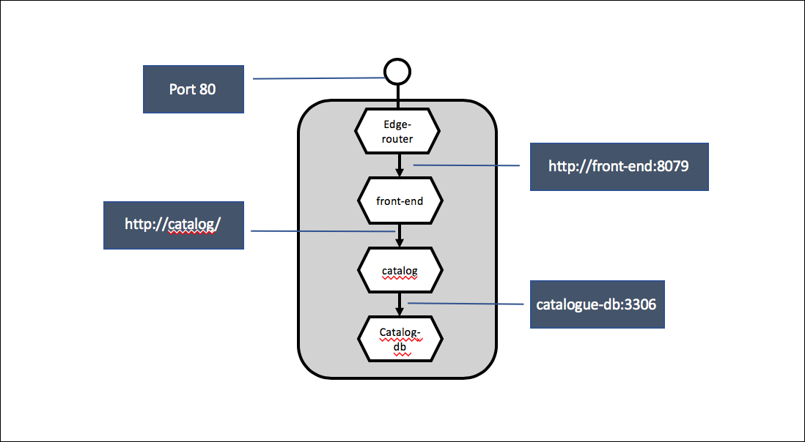
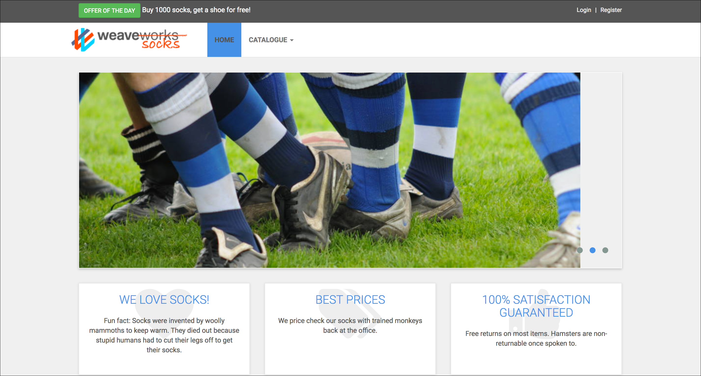

# Exercise 1: Run Sock-Shop with docker-compose

## Description:

In this exercise we get in touch with our example application Sock-Shop
and Docker-Compose.

Therefore Create a Docker compose which make the Web-Application
accessible with http://localhost on you local machine.

To not overload the example, we are just using as smaller set of the
sock-shop example like this:

Please use the following docker images:
* weaveworksdemos/edge-router:0.1.1
* weaveworksdemos/front-end:0.3.12
* weaveworksdemos/catalogue:0.3.5
* weaveworksdemos/catalogue-db:0.3.0

**Caution**: When you configure the catalogue-db image you have to set
the following parameter:

* MYSQL_ROOT_PASSWORD=${MYSQL_ROOT_PASSWORD}
* MYSQL_ALLOW_EMPTY_PASSWORD=true
* MYSQL_DATABASE=socksdb

## Task:

Please create a docker compose file which fulfills the following requirements:
* Startup the Sock-Shop Web Application
* The Sock-Shop will be available unter http://localhost via edge-router
* The front-end calls the cataloge servie unter URL: http://catalogue/
* The cataloge service will be connected to the catalogue-db with
  connection: catalogue-db:3306

You can startup the docker compose with

    docker-compose -f sock-shop-compose.yml up -d

## Test

After the docker compose is successfully started you can browse the shop
and the catalogue under the URL:

     http://localhost

And will see the following shop page:

## Optional

Use the docker and docker-compose commands to:
* get the status of the docker compose
* Lookup the log-entries produced by the containers of the compose
* stop the application
* Startup just the router and the front-end

