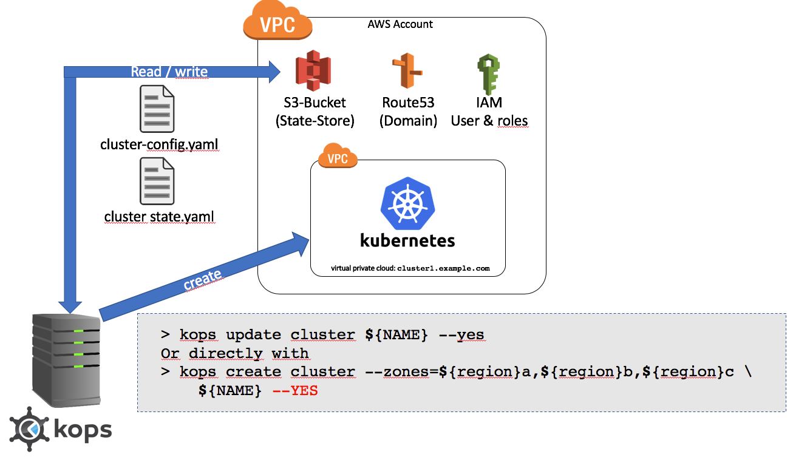

# Exercise 3: Deploy a Kubnernetes Cluster on AWS

## Description:

In this exercise we will start deploying kubernetes in on a real cloud
provider. In this case Amazon Web services.

For installing AWS we will user KOPS as installer:
https://github.com/kubernetes/kops

After you installed Kubernetes in AWS you should be able to install you
previous installes application in you AWS HA Kubernetes cluster.

## Prerequisite

Make sure that the credentials are set in file: ~/.aws/credentials

     [senacor]
     aws_access_key_id = xxx
     aws_secret_access_key = yyy

Make sure that the correct profile configuration is set in file: ~/.aws/config

     [profile senacor]
     region = eu-central-1

## Task:

* Choose the fitting DNS name for you team: team(1-5).cloudnative.senacor.com
* Use this DNS-Name although das clustername.
* Create an S3 Bucket as statestore for your cluster.
* Install a KOPS cluster with he following options:
  * 1 Master
  * 2 Nodes
  * A bastion host to connect via ssh
  * Add Lables via kops: CostCenter=cloudnative
* Deploy you Sock-Shop kubernetes application on this cluster

## Test

* Check if you cluster reaches a valid state with: kops validate cluster
* Try to reach the cluster via kubctl: kubectl -n kube-system get po
* Try to reach your application.

## Optional

* Identiy you ressources in AWS
  * Your master
  * Your nodes
  * Your Loadbalancer
* Have a look into your S3 bucket, what information are stored there. 

